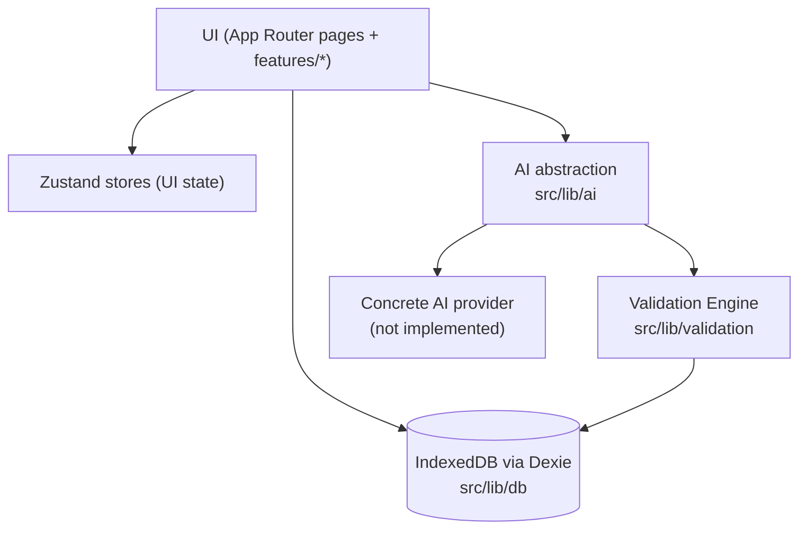
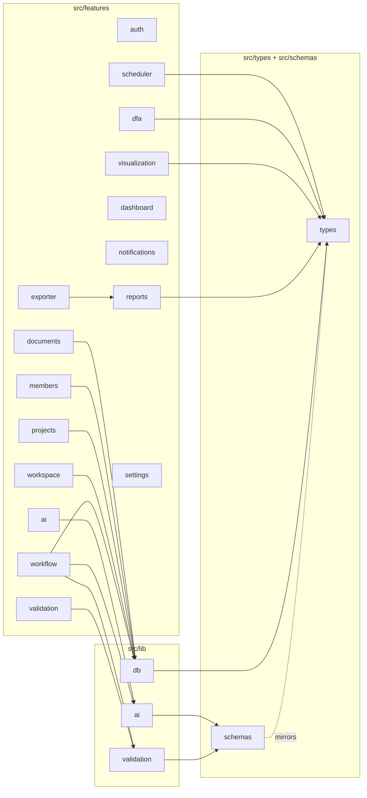
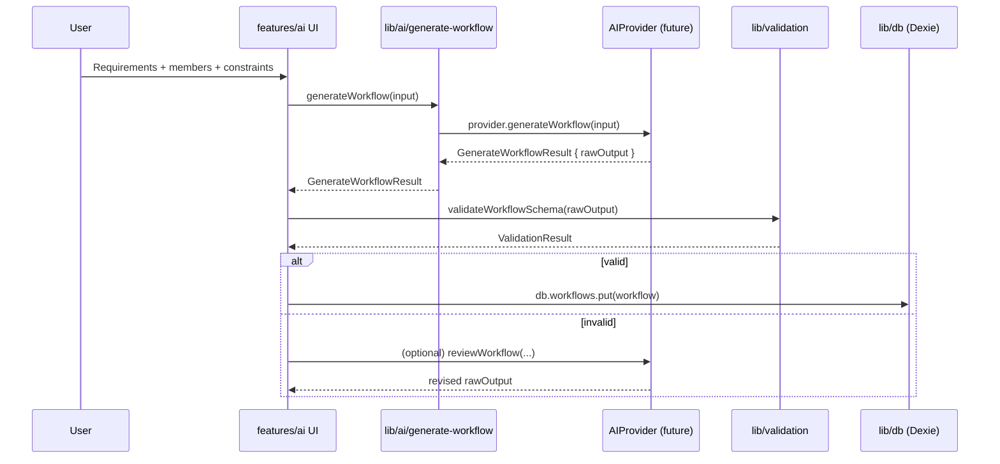
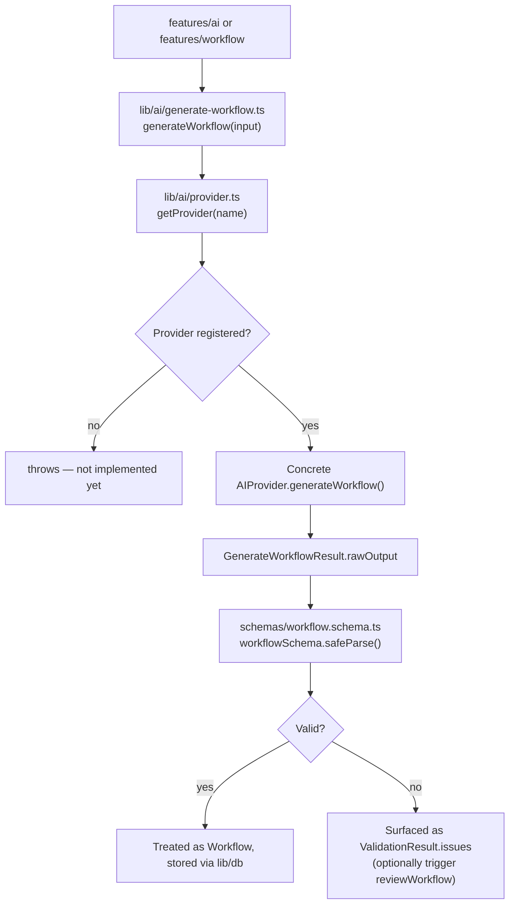
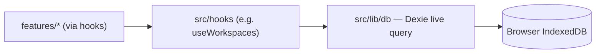
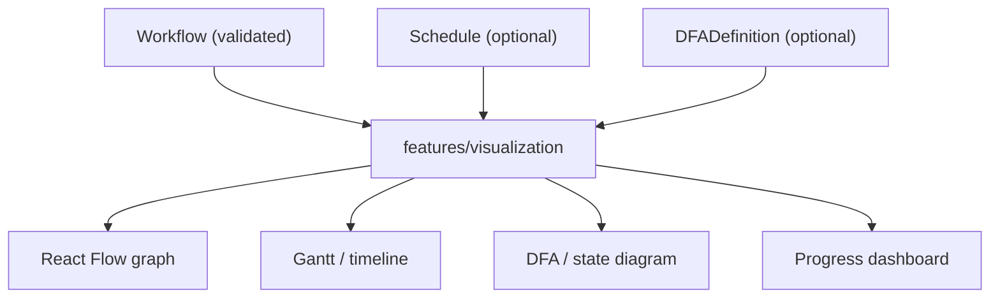
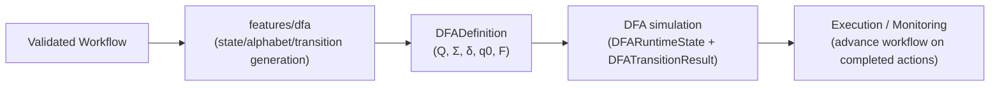
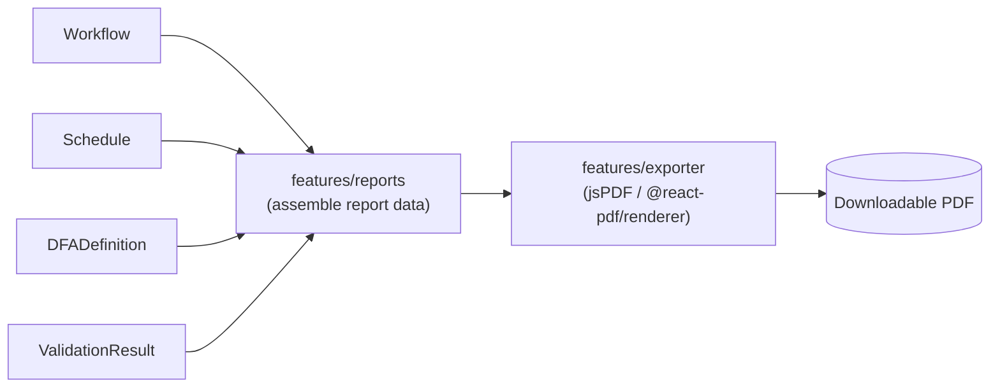

# FlowForge — Architecture

This document describes system architecture, module relationships, and
data flow. For product vision and phased plan, see `PROJECT_ROADMAP.md`.
For contribution rules, see `DEVELOPMENT_RULES.md`.

## 1. High-Level System Architecture

Everything the user sees lives under `src/app` (routing) and
`src/features/*` (feature UI + orchestration). Features never talk to
Dexie or an AI SDK directly — they go through `src/lib/db` and
`src/lib/ai` respectively. This indirection is what lets the persistence
layer and AI provider be swapped independently of feature code.

## 2. Module Relationships

Dependency rules:

- `src/features/*` may depend on `src/lib/*`, `src/types`, `src/schemas`,
  `src/hooks`, `src/stores`, `src/components/ui`, and other features'
  **public** `index.ts` exports only — never another feature's internals.
- `src/lib/*` may depend on `src/types` and `src/schemas`, but never on
  `src/features/*` or React (with the narrow exception of
  `src/hooks`, which is explicitly the React-aware layer over `src/lib/db`).
- `src/schemas` may depend on `src/types` (e.g. importing constants like
  `MAX_DOCUMENT_SIZE_BYTES`), never the reverse.
- Concrete AI providers (`src/lib/ai/providers/*`, not yet implemented)
  are only ever imported from `src/lib/ai/provider.ts`.

## 3. Workflow Compilation Pipeline (Data Flow)

Note: `validateWorkflowSemantics` (circular deps, skill mismatches,
schedule feasibility, DFA reachability) is a **future** step that would
run after schema validation and before the workflow is treated as final —
not yet implemented.

## 4. AI Flow

## 5. Storage Flow

All reads/writes go through `src/lib/db`'s `db` singleton, ideally wrapped
in a hook (see `src/hooks/use-workspaces.ts` for the established pattern)
so components get reactive live-query updates rather than one-off reads.

## 6. Future Visualization Flow

Not implemented yet. React Flow is the primary technology for the
interactive graph; other views (Gantt, calendar, DFA diagram, dashboard)
are separate rendering modes over the same underlying `Workflow` /
`Schedule` / `DFADefinition` data — they should not require separate data
models.

## 7. DFA Flow

Not implemented. Must be a genuine formal-language implementation per the
5-tuple contract in `src/types/dfa.ts` — see
`PROJECT_ROADMAP.md` §18 and `DEVELOPMENT_RULES.md` for the
non-negotiable correctness requirement.

## 8. Export Flow

Not implemented. `features/exporter` should depend on `features/reports`
for assembled, presentation-ready data rather than reaching into
`Workflow`/`Schedule`/`DFADefinition` directly, to keep report formatting
logic in one place.

## 9. Major Interfaces

- `AIProvider` (`src/types/ai.ts`) — contract every concrete AI provider
  must implement: `generateWorkflow(input)`, optional
  `reviewWorkflow(input, previousResult, issues)`.
- `Workflow` / `Task` / `Dependency` / `Schedule` / `Assignment` /
  `Milestone` (`src/types/*.ts`) — the Workflow IR.
- `DFADefinition` (`src/types/dfa.ts`) — the formal 5-tuple contract for
  the DFA engine.
- `ValidationResult` / `ValidationIssue` (`src/types/validation.ts`) — the
  shape every validation function (schema or semantic) must return.
- `FlowForgeDatabase` (`src/lib/db/database.ts`) — the Dexie schema; the
  single source of persisted application state.

## 10. Dependency Rules Between Modules (Summary)

| From \ To            | features/* | lib/*     | types/schemas | components/ui |
|-----------------------|:----------:|:---------:|:--------------:|:--------------:|
| features/* (own)      | public API only | ✅ | ✅ | ✅ |
| lib/*                 | ❌         | ✅ (siblings) | ✅ | ❌ |
| hooks/*                | ❌         | ✅ (lib/db) | ✅ | ❌ |
| types/*                | ❌         | ❌        | (types→types only) | ❌ |
| schemas/*              | ❌         | ❌        | ✅ (types)     | ❌ |

Never introduce a cycle where `src/lib` depends on `src/features`.
